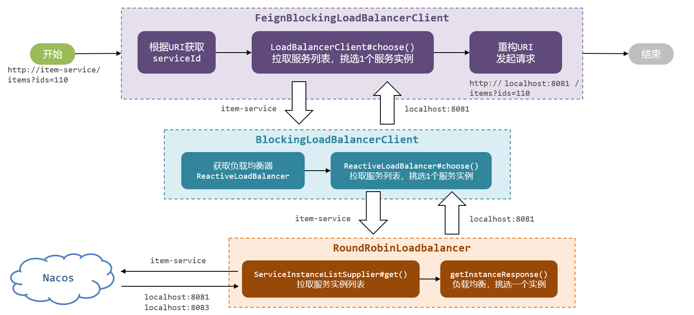
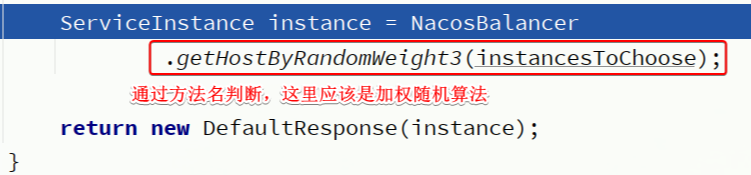

# 负载均衡原理




Spring在整合OpenFeign的时候

实现了`org.springframework.cloud.openfeign.loadbalancer.FeignBlockingLoadBalancerClient`类

其中定义了OpenFeign发起远程调用的核心流程,也就是四步:
- 获取请求中的serviceId
- 根据serviceId负载均衡,找出一个可用的服务实例
- 利用服务实例的ip和port信息重构url
- 向真正的url发起请求

而具体的负载均衡则是不是由OpenFeign组件负责,而是分成了负载均衡的接口规范,以及负载均衡的具体实现两部分:

1. 负载均衡的接口规范是定义在Spring-Cloud-Common模块中,包含下面的接口:
    - `LoadBalancerClient`:负载均衡客户端,职责是根据serviceId最终负载均衡,选出一个服务实例
    - `ReactiveLoadBalancer`:负载均衡器,负责具体的负载均衡算法

2. OpenFeign的负载均衡是基于Spring-Cloud-Common模块中的负载均衡规则接口,并没有写死具体实现,这就意味着以后还可以拓展其它各种负载均衡的实现,不过目前SpringCloud中只有`Spring-Cloud-Loadbalancer`这一种实现,在`Spring-Cloud-Loadbalancer`模块中,实现了Spring-Cloud-Common模块的相关接口,具体如下:
    - `BlockingLoadBalancerClient`:实现了`LoadBalancerClient`,会根据serviceId选出负载均衡器并调用其算法实现负载均衡
    - `RoundRobinLoadBalancer`:基于轮询算法实现了`ReactiveLoadBalancer`
    - `RandomLoadBalancer`:基于随机算法实现了`ReactiveLoadBalancer`

# 切换负载均衡算法

负载均衡的算法是有`ReactiveLoadBalancer`来定义的,它的实现类有三个,其中`RoundRobinLoadBalancer`(**默认**)和`RandomLoadBalancer`是由Spring-Cloud-Loadbalancer模块提供的,而`NacosLoadBalancer`则是由Nacos-Discorvery模块提供的

## 修改负载均衡策略

Spring-Cloud-Loadbalancer模块中有一个自动配置类:


其中定义了默认的负载均衡器:


这个Bean上添加了`@ConditionalOnMissingBean`注解,也就是说如果自定义了这个类型的bean,则负载均衡的策略就会被改变

所以修改负载均衡策略,需要自定义一个配置类`OpenFeignConfig`,如下(修改负载均衡策略为NacosLoadBalancer):

```java
import com.alibaba.cloud.nacos.NacosDiscoveryProperties;
import com.alibaba.cloud.nacos.loadbalancer.NacosLoadBalancer;
import org.springframework.cloud.client.ServiceInstance;
import org.springframework.cloud.loadbalancer.core.ReactorLoadBalancer;
import org.springframework.cloud.loadbalancer.core.ServiceInstanceListSupplier;
import org.springframework.cloud.loadbalancer.support.LoadBalancerClientFactory;
import org.springframework.context.annotation.Bean;
import org.springframework.core.env.Environment;

public class OpenFeignConfig {
    @Bean
    public ReactorLoadBalancer<ServiceInstance> reactorServiceInstanceLoadBalancer(
            Environment environment, NacosDiscoveryProperties properties,
            LoadBalancerClientFactory loadBalancerClientFactory) {
        String name = environment.getProperty(LoadBalancerClientFactory.PROPERTY_NAME);
        return new NacosLoadBalancer(
                loadBalancerClientFactory.getLazyProvider(name, ServiceInstanceListSupplier.class), name, properties);
    }
}
```

细节:**这个配置类千万不要加`@Configuration`注解,也不要被SpringBootApplication扫描到**

由于这个OpenFeignConfig没有加`@Configuration`注解,也就没有被Spring加载,因此是不会生效的,接下来,需要在启动类上通过注解来声明这个配置,有两种做法:

- 全局配置:对所有服务生效

```java
@LoadBalancerClients(defaultConfiguration = OpenFeignConfig.class)
```

- 局部配置:对指定服务生效(例如只针对item-service生效)

```java
@LoadBalancerClients({
        @LoadBalancerClient(value = "item-service", configuration = OpenFeignConfig.class)
})
```

### 负载均衡算法-NacosLoadBalancer


这部分代码的大概流程如下:
- 通过`ServiceInstanceListSupplier`获取服务实例列表
- 获取`NacosDiscoveryProperties`中的clusterName,也就是yml文件中的配置,代表当前服务实例所在集群信息
- 然后利用stream的filter过滤找到被调用的服务实例中与当前服务实例clusterName一致的,简单来说就是**服务调用者与服务提供者要在一个集群**



Nacos负载均衡会**优先调用同集群的服务实例,如果找不到就根据权重调用其他集群的服务实例**

Nacos注册中心 -> 服务列表 -> 具体实例 -> 编辑 -> 权重