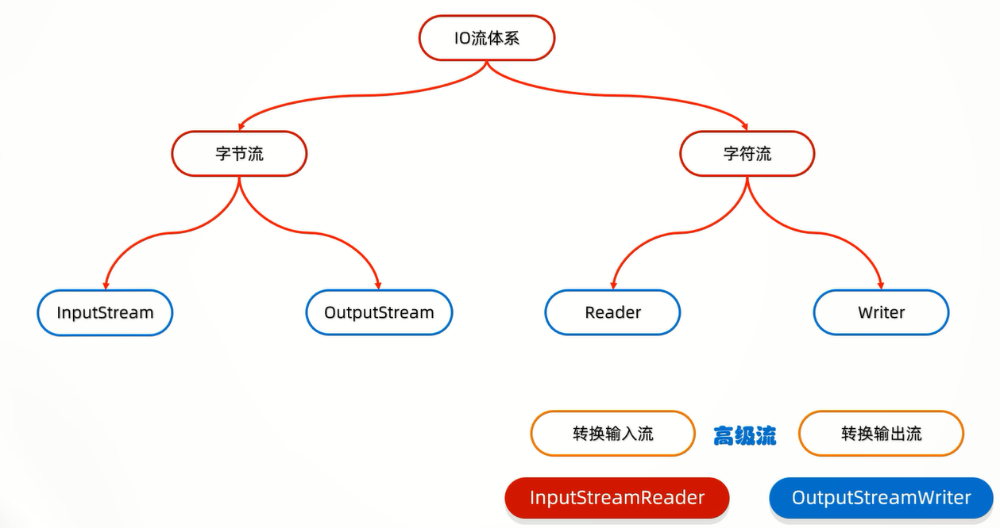
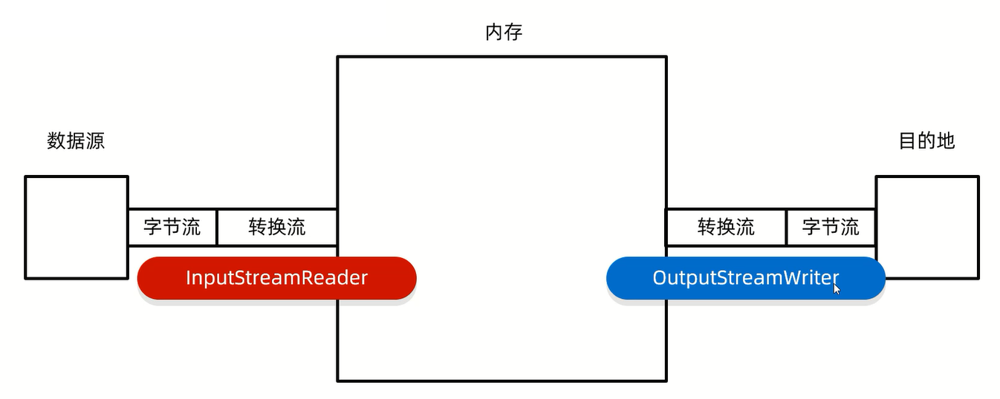

# 转换流

转换流是字节流和字符流之间的桥梁,属于字符流

1. 字符转换输入流:InputStreamReader     
2. 字符转换输出流:OutputStreamWriter



# 作用

1. 指定字符集读写数据(JDK11之后已淘汰)
2. 字节流想要使用字符流中的方法时,用转换流过渡

# 原理



# 练习

## 转换文件编码  

1. 手动创建一个GBK的文件,把文件中的中文读取到内存中,不能出现乱码

```java
import java.io.*;
import java.nio.charset.Charset;

public class Test {
    public static void main(String[] args) throws IOException {
        File src = new File("D:\\Project\\Test(IDEA)\\src.txt");
        readFile(src);
    }

    // JDK11时被淘汰
    // public static void readFile(File src) throws IOException {
    //     InputStreamReader isr = new InputStreamReader(new FileInputStream(src), "GBK");
    //     int read;
    //     while ((read = isr.read()) != -1) {
    //         System.out.print((char) read);
    //     }
    //     isr.close();
    // }

    public static void readFile(File src) throws IOException {
        FileReader fr = new FileReader(src, Charset.forName("GBK"));
        int read;
        while ((read = fr.read()) != -1) {
            System.out.print((char) read);
        }
        fr.close();
    }
}
```

2. 把一段中文按照GBK的方式写到本地文件

```java
import java.io.*;
import java.nio.charset.Charset;

public class Test {
    public static void main(String[] args) throws IOException {
        File dest = new File("D:\\Project\\Test(IDEA)\\dest.txt");
        writeFile(dest);
    }

    // JDK11时被淘汰
    // public static void writeFile(File dest) throws IOException {
    //     OutputStreamWriter osw = new OutputStreamWriter(new FileOutputStream(dest), "GBK");
    //     osw.write("你好啊!");
    //     osw.close();
    // }

    public static void writeFile(File dest) throws IOException {
        FileWriter fw = new FileWriter(dest, Charset.forName("GBK"));
        fw.write("你好!");
        fw.close();
    }
}
```

3. 将本地文件中的GBK文件,转成UTF-8

```java
import java.io.*;
import java.nio.charset.Charset;
import java.nio.charset.StandardCharsets;

public class Test {
    public static void main(String[] args) throws IOException {
        File src = new File("D:\\Project\\Test(IDEA)\\src.txt");
        File dest = new File("D:\\Project\\Test(IDEA)\\dest.txt");
        // GBKToUTF1(src, dest);
        GBKToUTF2(src, dest);
    }

    // JDK11之前的方案
    public static void GBKToUTF1(File src, File dest) throws IOException {
        InputStreamReader isr = new InputStreamReader(new FileInputStream(src), "GBK");
        OutputStreamWriter osw = new OutputStreamWriter(new FileOutputStream(dest), StandardCharsets.UTF_8);
        int read;
        while ((read = isr.read()) != -1) {
            osw.write(read);
        }
        osw.close();
        isr.close();
    }

    public static void GBKToUTF2(File src, File dest) throws IOException {
        FileReader fr = new FileReader(src, Charset.forName("GBK"));
        FileWriter fw = new FileWriter(dest, StandardCharsets.UTF_8);
        int read;
        while ((read = fr.read()) != -1) {
            fw.write(read);
        }
        fw.close();
        fr.close();
    }
}
```

## 读取文件中的数据

利用字节流读取文件中的数据,每次读一整行,而且不能出现乱码

```java
import java.io.*;

public class Test {
    public static void main(String[] args) throws IOException {
        File file = new File("D:\\Project\\Test(IDEA)\\dest.txt");
        BufferedReader br = new BufferedReader(new InputStreamReader(new FileInputStream(file)));
        String line;
        while ((line = br.readLine()) != null) {
            System.out.println(line);
        }
        br.close();
    }
}
```