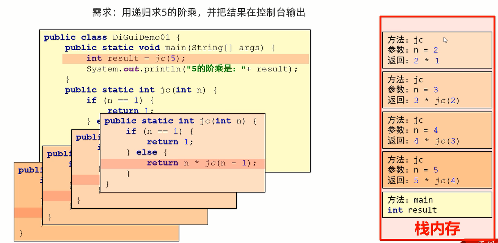
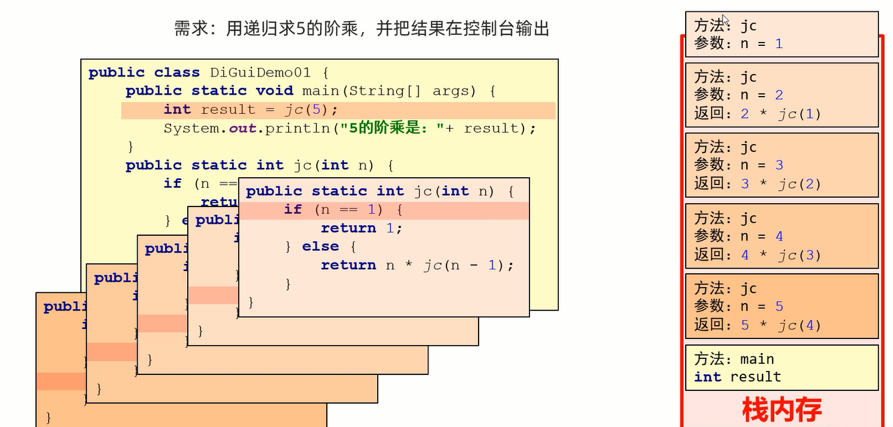
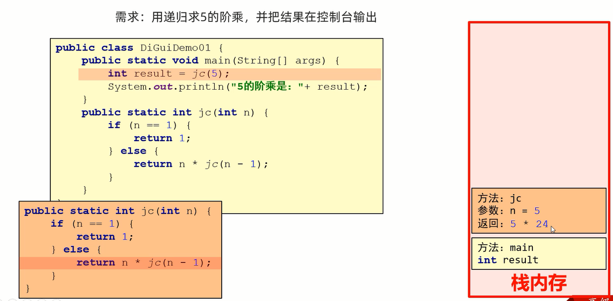

## 递归 

递归指的是方法中调用方法本身的现象

细节: 
1. **递归一定要有出口,否则就会出现内存溢出**
2. **方法内部再次调用方法的时候,参数必须要更加的靠近出口**

作用: 
1. 把一个复杂的问题层层转化为一个**与原问题相似的规模较小**的问题来解决
2. 递归策略只需要**少量的程序**就可描述出解题过程所需要的多次重复计算

核心: 
1. **找出口: 什么时候不再调用方法**
2. **找规则: 如何把大问题变成规模较小的问题**

范例: 

```java
public class Test {
    public static int i = 0;

    public static void main(String[] args) {
        method();
    }

    public static void method() {
        if (i < 100) {
            i++;
            method();
        } else {
            System.out.println(i);
        }
    }
}
```

练习: 

求1~100之间的和

```java
public class Test {
    public static void main(String[] args) {
        System.out.println(getSum(100));
    }

    public static int getSum(int number) {
        if (number == 1) {
            return 1;
        }
        return number + getSum(number - 1);
    }
}
```

练习: 

用递归求5的阶乘

```java
public class Test {
    public static void main(String[] args) {
        System.out.println(getFactorial(5));
    }

    public static int getFactorial(int number) {
        if (number == 1) {
            return 1;
        }
        return number*getFactorial(number - 1);
    }
}
```

## 内存图





