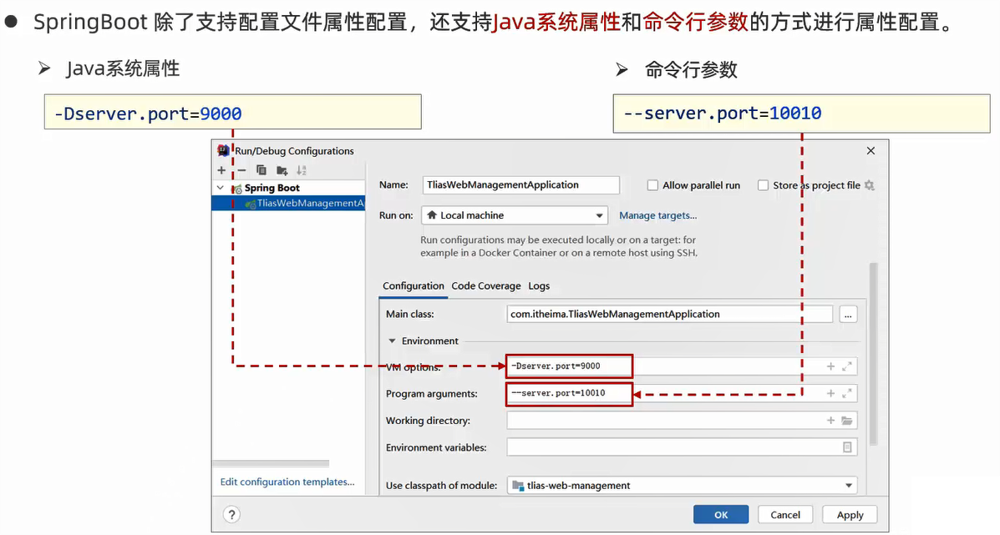
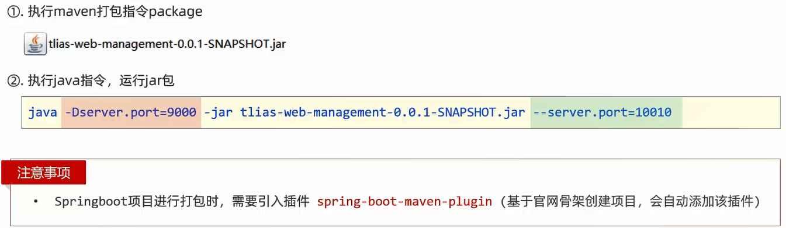
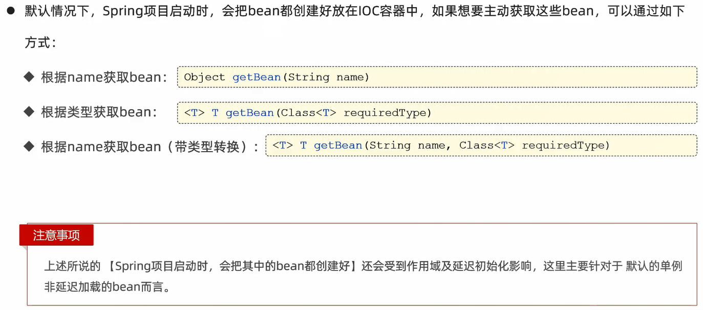
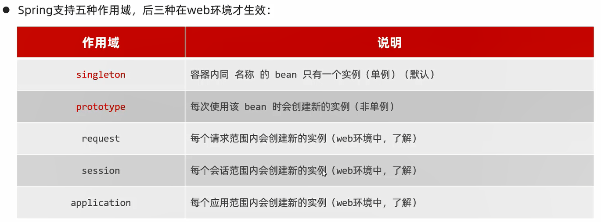
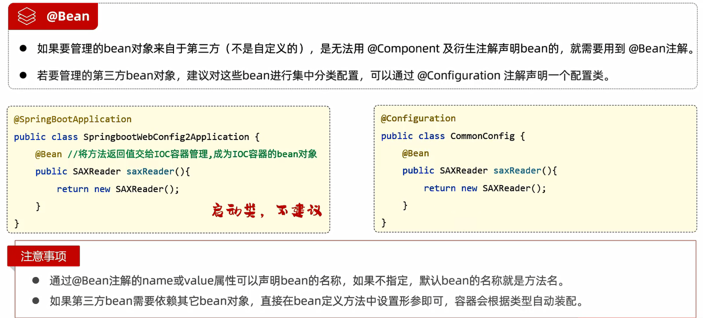

# 配置

## 配置优先级

SpringBoot中支持3种格式的配置文件:properties、yml、yaml

细节:**虽然SpringBoot支持多种格式的配置文件,但是在项目开发时,推荐统一使用一种格式的配置(主流是yml)**

### 配置Java系统属性和命令行参数



优先级:**命令行参数 >> Java系统属性 >> properties >> yml >> yaml**

#### 打包后配置Java系统属性和命令行参数



# Bean管理

## 获取bean



范例:

```java
package com.jinzhao;

import com.jinzhao.controller.DeptController;
import org.junit.jupiter.api.Test;
import org.springframework.beans.factory.annotation.Autowired;
import org.springframework.boot.test.context.SpringBootTest;
import org.springframework.context.ApplicationContext;

@SpringBootTest
class ClassManagementSystemApplicationTests {

    @Test
    void contextLoads() {
    }

    // IOC容器对象
    @Autowired
    private ApplicationContext applicationContext;

    // 获取bean对象
    @Test
    public void testGetBean() {
        // 根据bean的名称获取
        DeptController bean1 = (DeptController) applicationContext.getBean("deptController");
        System.out.println(bean1);

        // 根据bean的类型获取
        DeptController bean2 = applicationContext.getBean(DeptController.class);
        System.out.println(bean2);

        // 根据bean的名称及类型获取
        DeptController bean3 = applicationContext.getBean("deptController", DeptController.class);
        System.out.println(bean3);
    }
}
```

## bean作用域



通过`@Scope`注解来配置作用域

**默认情况下,bean对象是在容器启动时初始化的**

给bean对象加上`@Lazy`注解,可以让bean对象在第一次调用时才初始化

给bean对象加上`@Scope("prototype")`注解,在每次使用bean对象的时候都会创建新的bean对象

范例:

```java
...
@Scope("prototype")
@Slf4j
@RestController
@RequestMapping("/depts")
public class DeptController {
    ...
}
```

```java
package com.jinzhao;

import com.jinzhao.controller.DeptController;
import org.junit.jupiter.api.Test;
import org.springframework.beans.factory.annotation.Autowired;
import org.springframework.boot.test.context.SpringBootTest;
import org.springframework.context.ApplicationContext;

@SpringBootTest
class ClassManagementSystemApplicationTests {

    @Test
    void contextLoads() {
    }

    // IOC容器对象
    @Autowired
    private ApplicationContext applicationContext;

    // bean的作用域
    @Test
    public void testScope() {
        for (int i = 0; i < 10; i++) {
            DeptController deptController = applicationContext.getBean(DeptController.class);
            System.out.println(deptController);
        }
    }
}
```

细节:
1. **默认singleton的bean,在容器启动时被创建,可以使用`@Lazy`注解来延迟初始化(延迟到第一次使用时)**
2. **prototype的bean,每一次使用该bean的时候都会创建一个新的实例**
3. **实际开发当中,绝大部分的bean是单例的,即绝大部分bean不需要配置scope属性**

## 第三方bean



## 补充

`@Component`及衍生注解与`@Bean`注解使用场景:
- 项目中自定义,使用`@Component`及衍生注解
- 项目中引入第三方的,使用`@Bean`注解