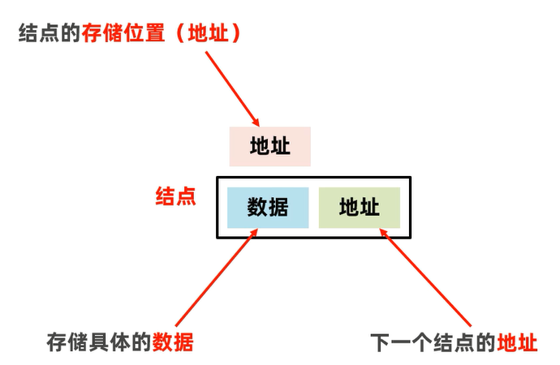
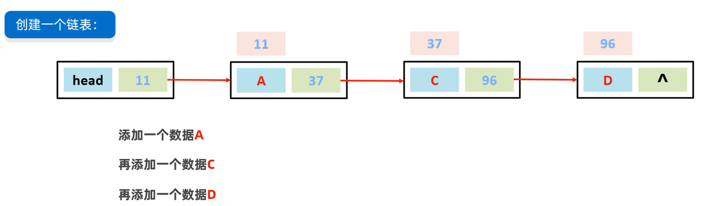
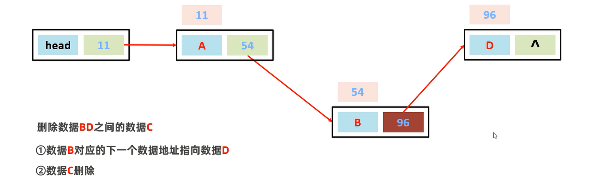
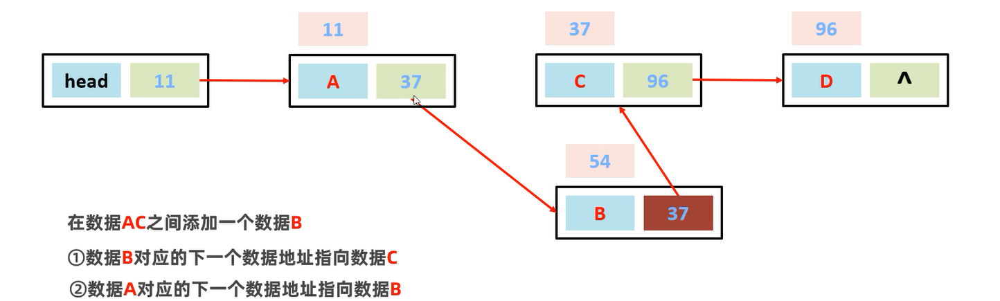
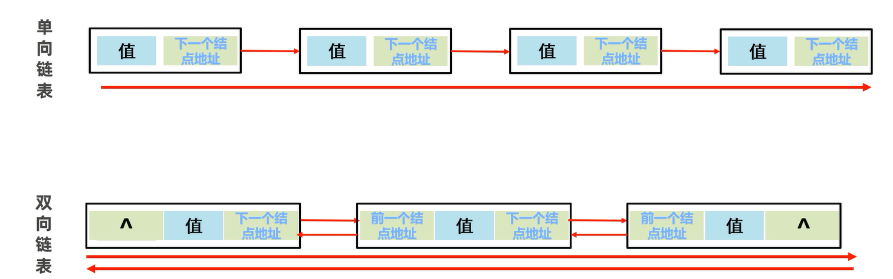

## 链表

结点: **链表中的结点是独立的对象,在内存中是不连续的**,每个结点包含数据值和下一个结点的地址

链表: 

### 特点 

**查询慢,增删块**

1. **查询速度快**      
无论查询哪个数据都要从头开始找

2. **删除效率高**         
修改结点的地址值

3. **添加效率高**        
修改结点的地址值   

## 单向链表、双向链表

