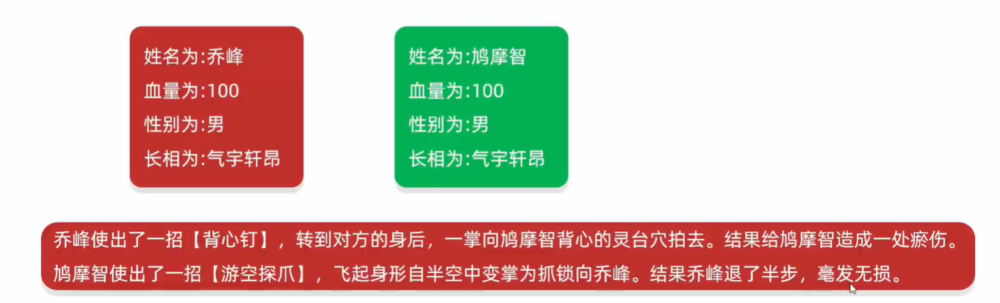

# 文字版格斗游戏


```java
import java.util.Random; 

public class role {
    private String name; 
    private int Blood; 

    public role() {
    }

    public role(String name,int Blood) {
        this.name = name; 
        this.Blood = Blood; 
    }

    public String getName() {
        return name; 
    }

    public void setName(String name) {
        this.name = name; 
    }

    public int getBlood() {
        return Blood; 
    }

    public void setBlood(int Blood) {
        this.Blood = Blood; 
    }

    // 定义一个方法用于攻击别人
    public void attack(role role) {
        Random random = new Random(); 
        // 造成随机1~20点伤害
        int harm = random.nextInt(20) + 1; 
        // 剩余血量
        int nowBlood = role.getBlood() - harm; 
        // 如果剩余血量小于0,则剩余血量赋值为0; 否则保持不变
        nowBlood = nowBlood < 0 ? 0 :  nowBlood; 
        // 修改被攻击者的血量为剩余血量
        role.setBlood(nowBlood); 
        // A攻击了B,造成了X点伤害,B还剩下Y点血量
        System.out.println(this.getName() + "举起拳头打了" + role.getName() + "一下,造成了"
                + harm + "点伤害," + role.getName() + "还剩下" + nowBlood + "点血"); 
    }
}
```

```java
public class playGame {
    public static void main(String[] args) {
        role r1 = new role("乔峰",200); 
        role r2 = new role("鸠摩智",200); 
        while(true){
            r1.attack(r2); 
            if(r2.getBlood() == 0){
                System.out.println(r1.getName() +"K.O了"+r2.getName()); 
                break; 
            }
            r2.attack(r1); 
            if(r1.getBlood() == 0){
                System.out.println(r2.getName() +"K.O了"+r1.getName()); 
                break; 
            }
        }
    }
}
```



```java
import java.util.Random; 

public class role {
    private String name; 
    private int blood; 
    private String gender; 
    private String outlook; 
    // 长相描述
    String[] boyfaces = {"风流俊雅","气宇轩昂","相貌英俊","五官端正","相貌平平","一塌糊涂","面目狰狞"}; 
    String[] girlfaces = {"美奂绝伦","沉鱼落雁","婷婷玉立","身材娇好","相貌平平","相貌简陋","惨不忍睹"}; 
    // 攻击描述
    String[] attacks_desc = {
            "%s使出了一招【背心钉】，转到对方的身后，一掌向%s背心的灵台穴拍去,",
            "%s使出了一招【游空探爪】，飞起身形自半空中变掌为抓锁向%s,",
            "%s大喝一声，身形下伏，一招【劈雷坠地】，捶向%s双腿,",
            "%s运气于掌，一瞬间掌心变得血红，一式【掌心雷】，推向%s,",
            "%s阴手翻起阳手跟进，一招【没遮拦】，结结实实的捶向%s,",
            "%s上步抢身，招中套招，一招【劈挂连环】，连环攻向%s,"
    }; 
    // 受伤描述
    String[] injureds_desc = {
            "结果%s退了半步，毫发无损,",
            "结果给%s造成一处瘀伤,",
            "结果一击命中，%s痛得弯下腰,",
            "结果%s痛苦地闷哼了一声，显然受了点内伤,",
            "结果%s摇摇晃晃，一跤摔倒在地,",
            "结果%s脸色一下变得惨白，连退了好几步,",
            "结果『轰』的一声，%s口中鲜血狂喷而出,",
            "结果%s一声惨叫，像滩软泥般塌了下去,"
    }; 

    public role() {
    }

    public role(String name,int blood,String gender) {
        this.name = name; 
        this.blood = blood; 
        this.gender = gender; 
        setOutlook(gender); 
    }

    public String getName() {
        return name; 
    }

    public void setName(String name) {
        this.name = name; 
    }

    public int getBlood() {
        return blood; 
    }

    public void setBlood(int blood) {
        this.blood = blood; 
    }

    public String getGender() {
        return gender; 
    }

    public void setGender(String gender) {
        this.gender = gender; 
    }

    public String getOutlook() {
        return outlook; 
    }

    public void setOutlook(String gender) {
        Random random = new Random(); 
        if (gender == "男") {
            this.outlook = boyfaces[random.nextInt(boyfaces.length)]; 
        } else if (gender == "女") {
            this.outlook = girlfaces[random.nextInt(girlfaces.length)]; 
        } else {
            this.outlook = "面目狰狞"; 
        }
    }

    // 定义一个方法用于攻击别人
    public void attack(role role) {
        Random random = new Random(); 
        // 使用随机招式
        String attackMode = attacks_desc[random.nextInt(attacks_desc.length)]; 
        // 造成随机10~29点伤害
        int harm = random.nextInt(20) + 10; 
        // 剩余血量
        int nowBlood = role.getBlood() - harm; 
        // 如果剩余血量小于0,则剩余血量赋值为0; 否则保持不变
        nowBlood = nowBlood < 0 ? 0 :  nowBlood; 
        // 修改被攻击者的血量为剩余血量
        role.setBlood(nowBlood); 
        System.out.printf(attackMode,this.getName(),role.getName()); 
        System.out.print("造成了" + harm + "点伤害,"); 
        String injuredMode = ""; 
        // 根据血量呈现不同的受伤效果
        if (nowBlood >= 90 && nowBlood< 100) {
            injuredMode = injureds_desc[0]; 
        }else if(nowBlood >= 80 && nowBlood< 90){
            injuredMode = injureds_desc[1]; 
        }else if(nowBlood >= 70 && nowBlood< 80){
            injuredMode = injureds_desc[2]; 
        }else if(nowBlood >= 60 && nowBlood< 70){
            injuredMode = injureds_desc[3]; 
        }else if(nowBlood >= 40 && nowBlood< 60){
            injuredMode = injureds_desc[4]; 
        }else if(nowBlood >= 20 && nowBlood< 40){
            injuredMode = injureds_desc[5]; 
        }else if(nowBlood >= 10 && nowBlood< 20) {
            injuredMode = injureds_desc[6]; 
        }else{
            injuredMode = injureds_desc[7]; 
        }
        System.out.printf(injuredMode,role.getName()); 
        System.out.println(role.getName() + "还剩下" + role.getBlood() + "点血量"); 
    }
}
```

```java
public class playGame {
    public static void main(String[] args) {
        role role1 = new role("乔峰",100,"男"); 
        role role2 = new role("小龙女",100,"女"); 
        while(true){
            role1.attack(role2); 
            if(role2.getBlood() == 0){
                System.out.println(role1.getOutlook()+"的"+role1.getName() +"K.O了"+role2.getOutlook()+"的"+role2.getName()); 
                break; 
            }
            role2.attack(role1); 
            if(role1.getBlood() == 0){
                System.out.println(role2.getOutlook()+"的"+role2.getName() +"K.O了"+role1.getOutlook()+"的"+role1.getName()); 
                break; 
            }
        }
    }
}
```

# 对象数组练习

## 两个对象数组练习

练习: 

定义数组存储3个商品对象  
商品的属性: 商品的id、名字、价格、库存  
创建3个商品对象,并把商品对象存入到数组当中  

```java
public class goods {
    private String id; 
    private String name; 
    private double price; 
    private int stock; 

    public goods() {
    }

    public goods(String id,String name,double price,int stock) {
        this.id = id; 
        this.name = name; 
        this.price = price; 
        this.stock = stock; 
    }

    public String getId() {
        return id; 
    }

    public void setId(String id) {
        this.id = id; 
    }

    public String getName() {
        return name; 
    }

    public void setName(String name) {
        this.name = name; 
    }

    public double getPrice() {
        return price; 
    }

    public void setPrice(double price) {
        this.price = price; 
    }

    public int getStock() {
        return stock; 
    }

    public void setStock(int stock) {
        this.stock = stock; 
    }
}
```

```java
public class test {
    public static void main(String[] args) {
        // 定义一个数组存储元素
        goods[] arr = new goods[3]; 
        goods apple = new goods("1","苹果",14.4,2000); 
        goods banana = new goods("2","香蕉",21.5,1000); 
        goods orange = new goods("3","橙子",18.9,500); 
        // 将商品添加到数组中
        arr[0] = apple; 
        arr[1] = banana; 
        arr[2] = orange; 
        for (int i = 0;  i < arr.length;  i++) {
            goods good = arr[i]; 
            System.out.println(good.getName()+","+good.getId()+","+good.getPrice()+","+good.getStock()); 
        }
    }
}
```

练习: 

定义数组存储3部汽车对象  
汽车的属性: 品牌、价格、颜色  
创建3个汽车对象,数据通过键盘录入而来,并把数据存入到数组当中  
 
```java
public class car {
    private String brand; 
    private double price; 
    private String color; 

    public car() {
    }

    public car(String brand,double price,String color) {
        this.brand = brand; 
        this.price = price; 
        this.color = color; 
    }

    public String getBrand() {
        return brand; 
    }

    public void setBrand(String brand) {
        this.brand = brand; 
    }

    public double getPrice() {
        return price; 
    }

    public void setPrice(double price) {
        this.price = price; 
    }

    public String getColor() {
        return color; 
    }

    public void setColor(String color) {
        this.color = color; 
    }
}
```

```java
import java.util.Scanner; 

public class test {
    public static void main(String[] args) {
        car[] arr = new car[3]; 
        Scanner scanner = new Scanner(System.in); 
        for (int i = 0;  i < arr.length;  i++) {
            car c = new car(); 
            System.out.println("请输入汽车品牌: "); 
            String brand = scanner.next(); 
            c.setBrand(brand); 
            System.out.println("请输入汽车的价格: "); 
            double price = scanner.nextDouble(); 
            c.setPrice(price); 
            System.out.println("请输入汽车的颜色: "); 
            String color = scanner.next(); 
            c.setColor(color); 
            arr[i] = c; 
        }
        for (int i = 0;  i < arr.length;  i++) {
            System.out.println(arr[i].getBrand()+","+arr[i].getPrice()+","+arr[i].getColor()); 
        }
    }
}
```

## 对象数组练习 -- 判断并统计

练习: 

定于数组存储3部手机对象  
手机的属性: 品牌、价格、颜色  
要求: 计算出3部手机的平均价格  

```java
public class phone {
    private String brand; 
    private double price; 
    private String color; 

    public phone() {
    }

    public phone(String brand,double price,String color) {
        this.brand = brand; 
        this.price = price; 
        this.color = color; 
    }

    public String getBrand() {
        return brand; 
    }

    public void setBrand(String brand) {
        this.brand = brand; 
    }

    public double getPrice() {
        return price; 
    }

    public void setPrice(double price) {
        this.price = price; 
    }

    public String getColor() {
        return color; 
    }

    public void setColor(String color) {
        this.color = color; 
    }
}
```

```java
import java.util.Scanner; 

public class test {
    public static void main(String[] args) {
        phone[] arr = new phone[3]; 
        Scanner sc = new Scanner(System.in); 
        for (int i = 0;  i < arr.length;  i++) {
            phone p = new phone(); 
            System.out.println("请输入品牌: "); 
            String brand = sc.next(); 
            p.setBrand(brand); 
            System.out.println("请输入价格: "); 
            double price = sc.nextDouble(); 
            p.setPrice(price); 
            System.out.println("请输入颜色: "); 
            String color = sc.next(); 
            p.setColor(color); 
            arr[i] = p; 
        }
        double sum = 0; 
        for (int i = 0;  i < arr.length;  i++) {
            phone ph = arr[i]; 
            // 打印所有信息
            System.out.println(ph.getBrand() + "," + ph.getPrice() + "," + ph.getColor()); 
            sum += ph.getPrice(); 
        }
        // 打印平均价格
        double averagePrice = sum / arr.length; 
        System.out.println(arr.length + "部手机的平均价格为: " + averagePrice); 
    }
}
```

练习: 

定义数组存储4个女朋友的对象  
女朋友的属性: 姓名、年龄、性别和爱好  
要求1: 计算出4个女朋友的平均年龄  
要求2: 统计年龄比平均值低的女朋友有几个,并把她们的所有信息打印出来  

```java
public class Girlfriend {
    private String name; 
    private int age; 
    private String gender; 
    private String hobby; 

    public Girlfriend() {
    }

    public Girlfriend(String name,int age,String gender,String hobby) {
        this.name = name; 
        this.age = age; 
        this.gender = gender; 
        this.hobby = hobby; 
    }

    public String getName() {
        return name; 
    }

    public void setName(String name) {
        this.name = name; 
    }

    public int getAge() {
        return age; 
    }

    public void setAge(int age) {
        this.age = age; 
    }

    public String getGender() {
        return gender; 
    }

    public void setGender(String gender) {
        this.gender = gender; 
    }

    public String getHobby() {
        return hobby; 
    }

    public void setHobby(String hobby) {
        this.hobby = hobby; 
    }
}
```

```java
public class GirlfriendTest {
    public static void main(String[] args) {
        Girlfriend gf1 = new Girlfriend("璐璐",20,"女","网络游戏"); 
        Girlfriend gf2 = new Girlfriend("颖颖",27,"女","追星"); 
        Girlfriend gf3 = new Girlfriend("月月",23,"女","羽毛球"); 
        Girlfriend gf4 = new Girlfriend("一一",18,"女","手游"); 
        // 创建数组存储女朋友的对象
        Girlfriend[] arr = new Girlfriend[4]; 
        arr[0] = gf1; 
        arr[1] = gf2; 
        arr[2] = gf3; 
        arr[3] = gf4; 
        // 求和
        int sum = 0; 
        for (int i = 0;  i < arr.length;  i++) {
            Girlfriend p = arr[i]; 
            sum += p.getAge(); 
        }
        // 求平均值
        double avg = (double) sum / arr.length; 
        System.out.println(arr.length + "个女朋友的平均年龄为: " + avg); 
        // 计数器
        int count = 0; 
        for (int i = 0;  i < arr.length;  i++) {
            // i表示索引,arr[i]表示对象
            Girlfriend p = arr[i]; 
            if (p.getAge() <= avg) {
                System.out.println(p.getName() + "," + p.getAge() + "," + p.getGender() + "," + p.getHobby()); 
                count++; 
            }
        }
        System.out.println("一共有" + count + "个女朋友比平均年龄小"); 
    }
}
```

## 复杂对象数组练习 -- 添加、遍历、删除和修改

定义一个长度为3的数组,数组存储1~3名学生对象作为初始数据,学生对象的学号、姓名各不相同  
学生的属性: 学号、姓名和年龄  
要求:    
1. 再次添加一个学生对象,并在添加的时候进行学号唯一性的判断  
2. 添加完毕后,遍历所有学生信息  
3. 通过id删除学生信息  
如果存在,则删除; 如果不存在,则提示删除失败  
4. 删除完毕后,遍历所有学生信息  
5. 查询数组id为"002"的学生,如果存在,则将他的年龄+1岁  
 
```java
public class Student {
    private int id; 
    private String name; 
    private int age; 

    public Student() {
    }

    public Student(int id,String name,int age) {
        this.id = id; 
        this.name = name; 
        this.age = age; 
    }

    public int getId() {
        return id; 
    }

    public void setId(int id) {
        this.id = id; 
    }

    public String getName() {
        return name; 
    }

    public void setName(String name) {
        this.name = name; 
    }

    public int getAge() {
        return age; 
    }

    public void setAge(int age) {
        this.age = age; 
    }
}
```

```java
import java.util.Scanner; 

public class StudentTest {
    public static void main(String[] args) {
        Student stu1 = new Student(1433,"张三",22); 
        Student stu2 = new Student(3123,"李四",21); 
        Student[] arr = new Student[3]; 
        arr[0] = stu1; 
        arr[1] = stu2; 
        Student stu4 = new Student(); 
        Scanner sc = new Scanner(System.in); 
        showArr(arr); 
        // 要求1: 添加的时候需要进行学号的唯一性判断
        System.out.println("请输入添加的学生的学号: "); 
        int addId = sc.nextInt(); 
        stu4.setId(addId); 
        int index = getIndex(arr,addId); 
        if (index >= 0) {
            // 学号已存在
            System.out.println("学号已存在,输入不合法!"); 
        } else {
            // 学号不存在
            // 判断数组是否还有空间,返回数组的元素个数
            int count = getCount(arr); 
            if (count != arr.length) {
                // 数组中还有空间
                System.out.println("请输入学生的姓名: "); 
                String addName = sc.next(); 
                stu4.setName(addName); 
                System.out.println("请输入学生的年龄: "); 
                int addAge = sc.nextInt(); 
                stu4.setAge(addAge); 
                // 将添加的学生对象放入空元素的索引位置,即添加到数组中
                arr[count] = stu4; 
                // 要求2: 添加完毕之后，遍历所有学生信息
                showArr(arr); 
                // 要求3: 通过id删除学生信息
                Student[] deleteArr = deleteArr(arr); 
                // 要求4: 删除完毕之后，遍历所有学生信息
                showArr(deleteArr); 
                // 要求5: id为X的学生，年龄+1岁
                Student[] processArr = processArr(deleteArr); 
                showArr(processArr); 
            } else {
                // 数组中没有空间
                // 将数组长度+1,并将原数组元素拷贝到新数组
                Student[] copyLongArr = copyLongArr(arr); 
                copyLongArr[copyLongArr.length - 1] = stu4; 
                // 要求2: 添加完毕之后，遍历所有学生信息
                showArr(copyLongArr); 
                // 要求3: 通过id删除学生信息
                Student[] deleteArr = deleteArr(copyLongArr); 
                // 要求4: 删除完毕之后，遍历所有学生信息
                showArr(deleteArr); 
                // 要求5: id为X的学生，年龄+1岁
                Student[] processArr = processArr(deleteArr); 
                showArr(processArr); 
            }
        }
    }

    // 要求5: id为X的学生，年龄+1岁
    public static Student[] processArr(Student[] arr) {
        Scanner sc = new Scanner(System.in); 
        System.out.println("请输入处理的学生的id: "); 
        int processId = sc.nextInt(); 
        int index = getIndex(arr,processId); 
        if (index >= 0) {
            // 存在处理的学生的id
            // 将该id的学生的年龄+1岁
            int oldAge = arr[index].getAge(); 
            arr[index].setAge(oldAge + 1); 
        } else {
            // 不存在处理的学生的id
            System.out.println("不存在相同的学生的id,处理失败!"); 
        }
        return arr; 
    }

    // 要求3: 通过id删除学生信息,返回数组
    public static Student[] deleteArr(Student[] arr) {
        Scanner sc = new Scanner(System.in); 
        System.out.println("请输入删除的学生的id: "); 
        int deleteId = sc.nextInt(); 
        int index = getIndex(arr,deleteId); 
        if (index >= 0) {
            // 存在删除的学生的id
            // 将该id的元素赋值为空
            arr[index] = null; 
        } else {
            // 不存在删除的学生的id
            System.out.println("不存在相同的学生的id,删除失败!"); 
        }
        return arr; 
    }

    // 要求2: 遍历所有学生信息
    public static void showArr(Student[] arr) {
        for (int i = 0;  i < arr.length;  i++) {
            Student stu = arr[i]; 
            // 遍历并打印出数组中存在的学生对象的所有信息
            if (stu != null) {
                System.out.println(stu.getId() + "," + stu.getName() + "," + stu.getAge()); 
            }
        }
    }

    // 将数组长度+1,并将原数组元素拷贝到新数组
    public static Student[] copyLongArr(Student[] arr) {
        // 数组长度+1
        Student[] newArr = new Student[arr.length + 1]; 
        for (int i = 0;  i < arr.length;  i++) {
            newArr[i] = arr[i]; 
        }
        return newArr; 
    }


    // 判断数组是否还有空间,返回数组元素个数
    public static int getCount(Student[] arr) {
        // 计数器
        int count = 0; 
        for (int i = 0;  i < arr.length;  i++) {
            Student stu = arr[i]; 
            // 数组元素不为空,元素数量+1
            if (stu != null) {
                count++; 
            }
        }
        // count也表示空元素的索引位置
        return count; 
    }

    // 判断元素是否存在于数组中: 如果数组中存在该元素,则返回其元素的索引位置; 反之,返回索引-1
    public static int getIndex(Student[] arr,int id) {
        // 元素索引
        int index = 0; 
        for (int i = 0;  i < arr.length;  i++) {
            Student student = arr[i]; 
            if (student != null) {
                // 判断数组中的每一个学生对象的id是否与输入的学生对象的id一致
                if (student.getId() == id) {
                    // 返回有相同id的元素的索引位置
                    return index; 
                }
            }
            index++; 
        }
        return -1; 
    }
}
```