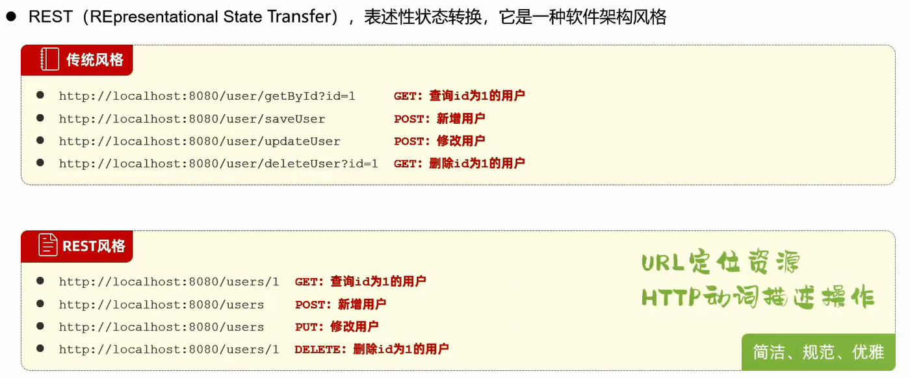
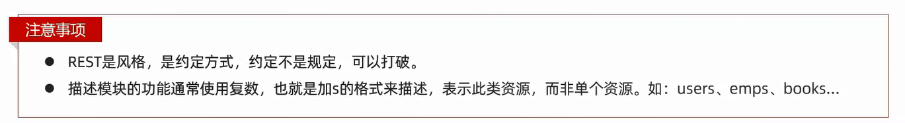
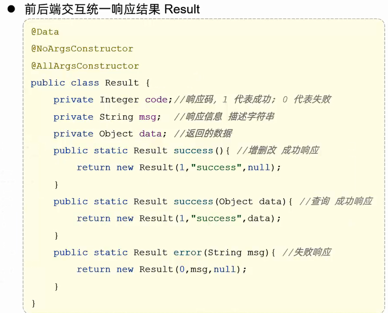
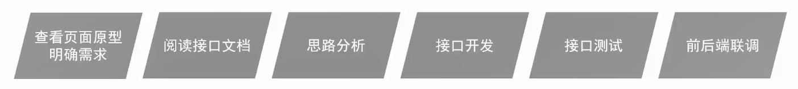
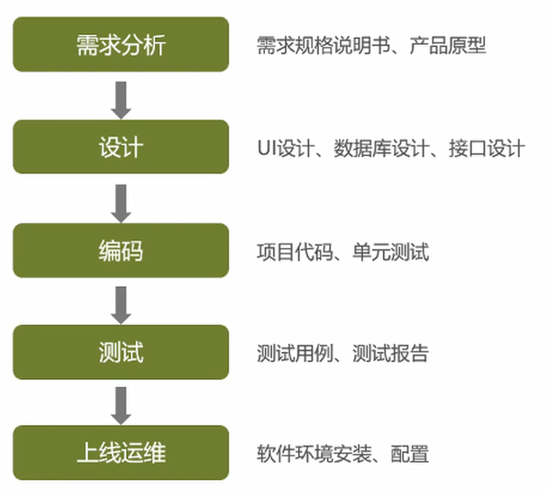
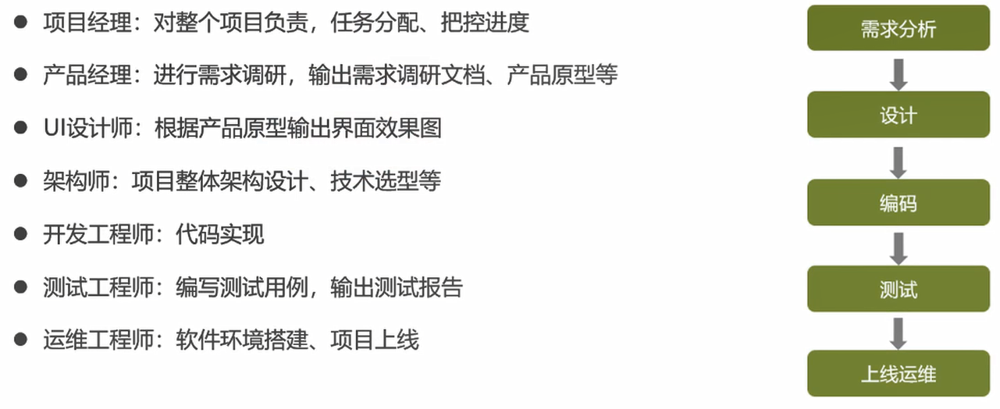
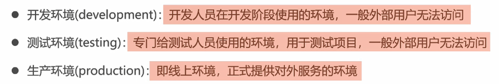
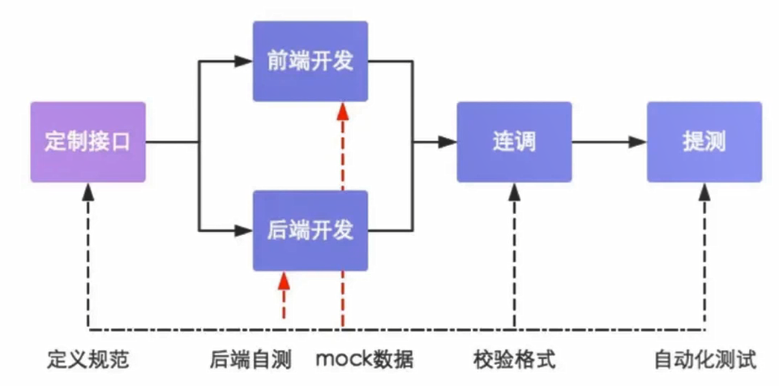

# 开发规范

一般情况下

`@RequestMapping(value = "/depts", method = RequestMethod.GET)`:指定请求路径为/depts,请求方式为GET

而在Spring中可以用以下方式简化

`@GetMapping("/depts")`:指定请求路径为/depts,请求方式为GET

# 统一响应结果

# 开发流程

# 角色分工

# 软件环境

# 前后端分离开发流程

# VO、DTO、BO、PO、DO区别

- VO:(View Object)视图对象,一般位于Controller层,用于展示视图
- DTO:(Data Transfer Object)数据传输对象,即RPC接口请求或传输出去的对象,用于展示层与服务层之间的数据传输对象
- BO:(Business Object)业务层对象,一般位于Service层,它与DO会有一定的属性差别
- PO:(Persistent Object)持久化对象,对象属性与数据库字段形成映射关系
- DO:(Domain Object)领域对象,就是从现实世界中抽象出来的有形或无形的业务实体,可以当成BO;(Data Object)数据层对象,对象属性与数据库字段形成映射关系,可以当成PO

