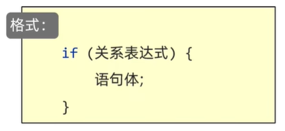
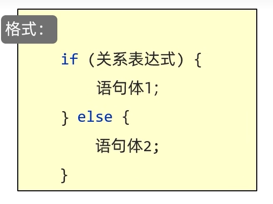
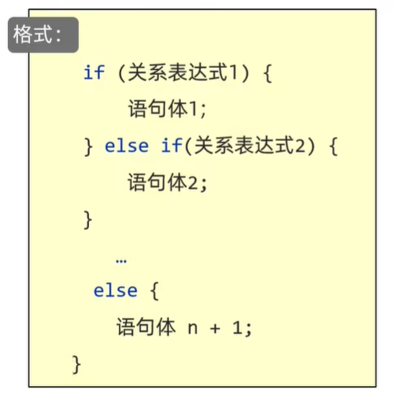
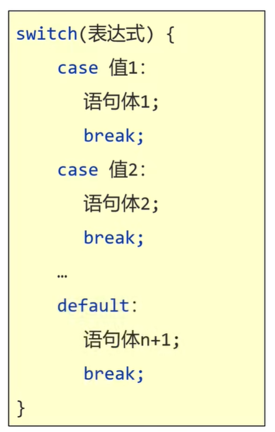

# 顺序结构

先后顺序,从上至下

# 分支结构

## if语句

1. 第一种格式: 单条件判断

2. 第二种格式: 双条件判断

3. 第三种格式: 多条件判断

注意事项: 
1. **大括号的开头可以另起一行书写,但是建议写在第一行的末尾**
2. **在语句体中,如果只有一句代码,大括号可以省略不写,但是建议大括号不要省略**   
例如`int a = 100; `不是一句代码,其中包含了"定义变量a"和"给变量a赋值为100"两句代码
3. **如果对一个布尔类型的变量进行判断,不要用`==`号,直接把变量写在()中即可**   
例如`if(flag == true)`很容易把`==`(判断表达式)写成`=`(赋值表达式)   
为了避免出错,直接写`if(flag)`

## 第一种格式



首先,计算关系表达式的值   
如果关系表达式的值为true,则执行语句体  
如果关系表达式的值为false,则不执行语句体  
继续执行后面的语句   

练习: 

老丈人测酒量,酒量大于2斤,老丈人给出回应; 反之则无回应

```java
import java.util.Scanner; 

public class test {
    public static void main(String[] args) {
        Scanner sc = new Scanner(System.in); 
        System.out.println("请输入你的酒量: "); 
        int jiu = sc.nextInt(); 
        if (jiu > 2) {
            System.out.println("老丈人: 你小子酒量不错啊!"); 
        }
    }
}
```

练习: 

考试考第一,做你女朋友

```java
import java.util.Scanner; 

public class test {
    public static void main(String[] args) {
        Scanner sc = new Scanner(System.in); 
        System.out.println("请输入你的成绩排名: "); 
        int rank = sc.nextInt(); 
        if (rank == 1) {
        System.out.println("我要做你女朋友!"); 
        }
        System.out.println("你太菜还不配!"); 
    }
}
```

练习: 

红灯停止,绿灯行驶,黄灯减速

```java
public class test {
    public static void main(String[] args) {
        boolean isLightRed = false; 
        if(isLightRed){
            System.out.println("停止!"); 
        }
        boolean isLightGreen = false; 
        if(isLightGreen){
            System.out.println("行驶!"); 
        }
        boolean isLightYellow = true; 
        if(isLightYellow){
            System.out.println("减速!"); 
        }
    }
}
```

## 第二种格式



首先,计算关系表达式的值  
如果关系表达式的值为true,则执行语句体1  
如果关系表达式的值为false,则执行语句体2  
继续执行后面的语句   

练习: 

键盘录入一个整数,表示身上的钱  
如果大于等于100块就吃肯德基  
否则就吃华莱士  

```java
import java.util.Scanner; 

public class test {
    public static void main(String[] args) {
        Scanner sc = new Scanner(System.in); 
        System.out.println("请输入身上的钱: "); 
        int money = sc.nextInt(); 
        if(money >= 100){
            System.out.println("吃肯德基!"); 
        }else{
            System.out.println("吃华莱士!"); 
        }
    }
}
```

练习: 

商品价格600块,输入实际支付的钱

```java
import java.util.Scanner; 

public class test {
    public static void main(String[] args) {
        Scanner sc = new Scanner(System.in); 
        System.out.println("实际支付: "); 
        int money = sc.nextInt(); 
        if(money >= 600){
            System.out.println("付款成功!"); 
        }else{
            System.out.println("付款失败!"); 
        }
    }
}
```

练习: 

影院选座,100张票,票的序号1~100  
奇数票号坐左边座位,偶数票号坐右边座位  

```java
import java.util.Scanner; 

public class test {
    public static void main(String[] args) {
        Scanner sc = new Scanner(System.in); 
        System.out.println("请输入你的票号: "); 
        int number = sc.nextInt(); 
        if(number >= 1 && number <= 100) {
            if (number % 2 == 0) {
                System.out.println("坐右边!"); 
            } else {
                System.out.println("坐左边!"); 
            }
        } else {
            System.out.println("你小子还想看电影!"); 
        }
    }
}
```

练习: 

李雷想买一个价值7988元的新手机,她的旧手机在二手市场能卖1500元   
而手机专卖店推出以旧换新的优惠,把她的旧手机交给店家,新手机就能够打8折优惠  
为了更省钱,李雷要不要以旧换新?请在控制台输出   

```java
public class test {
    public static void main(String[] args) {
        double cost1 = 7988 - 1500; 
        double cost2 = 7988 * 0.8; 
        if (cost1 > cost2) {
            System.out.println("把旧手机给商家更划算"); 
        } else {
            System.out.println("自己卖旧手机更划算"); 
        }
    }
}
```

## 第三种格式



首先,计算关系表达式1的值  
如果关系表达式1的值为true,则执行语句体1  
如果关系表达式1的值为false,则计算关系表达式2的值  
如果关系表达式2的值为true,则执行语句体2  
如果关系表达式2的值为false,则计算关系表达式3的值  
......  
继续执行后面的语句  

练习: 

100分的卷子:      
儿子考到85-90分(包括90分)就送变形金刚      
儿子考到90-95分(包括95分)就送自行车     
儿子考到95-100分(包括100分)就送平板电脑     

```java
import java.util.Scanner; 

public class test {
    public static void main(String[] args) {
        Scanner sc = new Scanner(System.in); 
        System.out.println("请输入儿子的成绩: "); 
        int score = sc.nextInt(); 
        if (score >= 0 && score <= 100) {
            if (score > 85 && score <= 90) {
                System.out.println("奖变形金刚一套!"); 
            } else if (score > 90 && score <= 95) {
                System.out.println("奖自行车一辆!"); 
            } else {
                System.out.println("奖平板电脑一台!"); 
            } else {
                System.out.println("考的太低,奖皮鞭一顿!"); 
            }
        }
        System.out.println("输入的成绩不合法!"); 
    }
}
```

练习: 

买奢饰品,会员分3级打折优惠,非会员无优惠 :
会员1级,打9折   
会员2级,打8折   
会员3级,打7折   

```java
import java.util.Scanner; 

public class test {
    public static void main(String[] args) {
        Scanner sc = new Scanner(System.in); 
        System.out.println("请输入你的商品价格: "); 
        int price = sc.nextInt(); 
        System.out.println("请输入你的会员级别: "); 
        int grade = sc.nextInt(); 
        if(grade >= 1 && grade <= 3){
            if(grade == 1){
                System.out.println("你需要实际支付: " + (int)(0.9 * price)); 
            }else if(grade == 2){
                System.out.println("你需要实际支付: " + (int)(0.8 * price)); 
            }else{
                System.out.println("你需要实际支付: " + (int)(0.7 * price)); 
            }
        }else{
            System.out.println("不打折,你需要支付: " + price); 
        }
    }
}
```

练习: 

红灯停止,绿灯行驶,黄灯减速

```java
public class test {
    public static void main(String[] args) {
        boolean isLightRed = false; 
        boolean isLightGreen = false; 
        boolean isLightYellow = true; 
        if(isLightRed){
            System.out.println("停止!"); 
        }else if(isLightGreen){
            System.out.println("行驶!"); 
        }else if(isLightYellow){
            System.out.println("减速!"); 
        }
    }
}
```

练习: 

让用户依次录入三个整数,求出三个数中的最小值,并打印到控制台

```java
import java.util.Scanner; 

public class test {
    public static void main(String[] args) {
        Scanner sc = new Scanner(System.in); 
        System.out.println("请输入第一个整数: "); 
        int number1 = sc.nextInt(); 
        System.out.println("请输入第二个整数: "); 
        int number2 = sc.nextInt(); 
        System.out.println("请输入第三个整数: "); 
        int number3 = sc.nextInt(); 
        int min = number1; 
        if (number2 <= min) {
            min = number2; 
        } else if (number3 <= min) {
            min = number3; 
        }
        System.out.println("最小值为: " + min); 
    }
}
```

```java
import java.util.Scanner; 

public class test {
    public static void main(String[] args) {
        Scanner sc = new Scanner(System.in); 
        System.out.println("请输入第一个整数: "); 
        int number1 = sc.nextInt(); 
        System.out.println("请输入第二个整数: "); 
        int number2 = sc.nextInt(); 
        System.out.println("请输入第三个整数: "); 
        int number3 = sc.nextInt(); 
        int min = number1 < number2 ? number1: number2; 
        int result = min < number3 ? min: number3; 
        System.out.println("最小值为: " + result); 
    }
}
```

练习: 

某银行推出了整存整取定期储蓄业务,其存期分为一年、两年、三年、五年,到期凭存单支取本息   

存款年利率表如下:   
​存期 -- 年利率(%)   
​一年 -- 2.25  
​两年 -- 2.7   
​三年 -- 3.25   
​五年 -- 3.6    

请存入一定金额(1000起存),存一定年限(四选一),计算到期后得到的本息总额   

```java
import java.util.Scanner; 

public class test {
    public static void main(String[] args) {
        Scanner sc = new Scanner(System.in); 
        System.out.println("年限方案如下: "); 
        System.out.println("方案\t\t存期\t\t年利率(%)"); 
        System.out.println("1\t\t一年\t\t2.25"); 
        System.out.println("2\t\t两年\t\t2.7"); 
        System.out.println("3\t\t三年\t\t3.25"); 
        System.out.println("4\t\t五年\t\t3.6"); 
        while (true) {
            System.out.println("请选择年限方案(1~4): "); 
            int caseChoose = sc.nextInt(); 
            System.out.println("请输入存款(大于等于1000): "); 
            int money = sc.nextInt(); 
            double moneySum = rateAndMoney(money, caseChoose); 
            if (moneySum == -1) {
                System.out.println("输入不合法,请重新输入!"); 
            } else {
                System.out.println("到期后得到的本息总额为: " + moneySum); 
                break; 
            }
        }
    }

    public static double rateAndMoney(int money, int caseChoose) {
        if (money < 1000) {
            return -1; 
        }
        if (caseChoose < 1 || caseChoose > 4) {
            return -1; 
        } else if (caseChoose == 1) {
            return money + money * 0.0225 * 1; 
        } else if (caseChoose == 2) {
            return money + money * 0.027 * 2; 
        } else if (caseChoose == 3) {
            return money + money * 0.0325 * 3; 
        } else {
            return money + money * 0.036 * 5; 
        }
    }
}
```

练习: 
 
某商场购物可以打折,具体规则如下:   
​普通顾客购不满100元不打折,满100元打9折;    
​会员购物不满200元打8折,满200元打7.5折;   
​不同打折规则不累加计算    

请根据此优惠计划进行购物结算,键盘录入顾客的类别(0表示普通顾客，1表示会员)和购物的折前金额(整数即可)     
输出应付金额(小数类型)   

```java
import java.util.Scanner; 

public class test {
    public static void main(String[] args) {
        Scanner sc = new Scanner(System.in); 
        while (true) {
            System.out.println("请输入顾客的类别(0表示普通顾客，1表示会员): "); 
            int type = sc.nextInt(); 
            System.out.println("请输入购物的折前金额："); 
            double money = sc.nextDouble(); 
            double cost = cost(type, money); 
            if (cost == -1) {
                System.out.println("输入不合法,请重新输入!"); 
            } else {
                System.out.println("应付金额为: " + cost); 
                break; 
            }
        }
    }

    public static double cost(int type, double money) {
        // 非法顾客
        if (type < 0 || type > 1) {
            return -1; 
        }
        // 普通顾客
        if (type == 0) {
            if (money > 0 && money < 100) {
                return money; 
            } else if (money >= 100) {
                return money * 0.9; 
            } else {
                return -1; 
            }
        }
        // 会员顾客
        if (money > 0 && money < 200) {
            return money * 0.8; 
        } else if (money >= 200) {
            return money * 0.75; 
        } else {
            return -1; 
        }
    }
}
```

练习: 

2019年1月1日起,国家推出新的个人所得税政策,起征点上调值5000元     
也就是说税前工资扣除三险一金(三险一金数额假设是税前工资的10%)后      

如果不足5000元,则不交税; 如果大于5000元,那么大于5000元的部分按梯度交税,具体梯度比例如下:       
- 0-3000元的部分,交税3%  			  
- 3000-12000元的部分,交税10%
- 12000-25000的部分,交税20%
- 25000-35000的部分,交税25%      
- 35000-55000的部分,交税30%
- 55000-80000的部分,交税35%
- 超过80000的部分,交税45%   

比如: 入职一家企业后,税前工资是15000,则他每月该交个税的部分是15000-1500-5000=8500元  
个税缴纳数额是3000×3%+5500×10%=640元,税后工资12860元        

请完成一个个税计算程序,在用户输入税前工资后,计算出他对应的纳税数额,以及税后工资为多少       

```java
import java.util.Scanner; 

public class test {
    public static void main(String[] args) {
        Scanner sc = new Scanner(System.in); 
        System.out.println("请输入你的税前工资: "); 
        double money = sc.nextInt(); 
        double tax = getTax(money); 
        double sum = money * 0.9 - tax; 
        System.out.println("纳税数额为: " + tax + "元" + "税后工资为: " + sum + "元"); 
    }

    public static double getTax(double money) {
        // 达不到起征点: (工资-三险一金)<起征点
        if (money * 0.9 <= 5000) {
            return 0; 
        }
        // 达到起征点,应交税部分=(工资-三险一金)-起征点数额
        double newMoney = money * 0.9 - 5000; 
        double tax = 0; 
        // 按梯度交税
        if (newMoney > 0 && newMoney <= 3000) {
            tax = newMoney * 0.03; 
        } else if (newMoney > 3000 && newMoney <= 12000) {
            tax = 3000 * 0.03 + (newMoney - 3000) * 0.1; 
        } else if (newMoney > 12000 && newMoney <= 25000) {
            tax = 3000 * 0.03 + 9000 * 0.1 + (newMoney - 12000) * 0.2; 
        } else if (newMoney > 25000 && newMoney <= 35000) {
            tax = 3000 * 0.03 + 9000 * 0.1 + 13000 * 0.2 + (newMoney - 25000) * 0.25; 
        } else if (newMoney > 35000 && newMoney <= 55000) {
            tax = 3000 * 0.03 + 9000 * 0.1 + 13000 * 0.2 + 10000 * 0.25 + (newMoney - 35000) * 0.3; 
        } else if (newMoney > 55000 && newMoney <= 80000) {
            tax = 3000 * 0.03 + 9000 * 0.1 + 13000 * 0.2 + 10000 * 0.25 + 20000 * 0.3 + (newMoney - 55000) * 0.35; 
        } else {
            tax = 3000 * 0.03 + 9000 * 0.1 + 13000 * 0.2 + 10000 * 0.25 + 20000 * 0.3 + 25000 * 0.35 + (newMoney - 80000) * 0.45; 
        }
        return tax; 
    }
}
```

## switch语句



首先,计算表达式的值       
依次和`case`后面的值进行比较      
如果有对应的值,就会执行相应的语句,在执行的过程中遇到break就会结束      
如果所有的case后面的值和表达式的值都不匹配,就会执行default里面的语句体,然后结束整个`switch`语句     

## switch注意点

1. **表达式: (将要匹配的值)取值为byte、short、int、char**
JDK5以后可以是枚举,JDK7以后可以是String
2. **`case`: 后面跟的是要和表达式进行比较的值(被匹配的值)**
3. **break: 表示中断、结束的意思,用来结束`switch`语句**
4. **default: 表示所有情况都不匹配的时候,就执行该处的内容,和if语句中的`else`相似**
5. **`case`后面的值只能是字面量,不能是变量**
6. **`case`给出的值不允许重复**

练习: 

四种面,选一种面吃

```java
import java.util.Scanner; 

public class test {
    public static void main(String[] args) {
        Scanner sc = new Scanner(System.in); 
        System.out.println("四种面,请输入你的选项(1~4): "); 
        int number = sc.nextInt(); 
        switch (number){
            case 1:
                System.out.println("炸酱面"); 
                break; 
            case 2:
                System.out.println("大排面"); 
                break; 
            case 3:
                System.out.println("兰州拉面"); 
                break; 
            case 4:
                System.out.println("素面"); 
                break; 
            default:
                System.out.println("不在选项范围内!"); 
                break; 
        }
    }
}
```

练习: 

键盘录入星期数,显示今天的运动计划

```java
import java.util.Scanner; 

public class test {
    public static void main(String[] args) {
        Scanner sc = new Scanner(System.in); 
        System.out.println("请输入星期数(1~7): "); 
        int week = sc.nextInt(); 
        switch (week){
            case 1:
                System.out.println("跑步"); 
                break; 
            case 2:
                System.out.println("游泳"); 
                break; 
            case 3:
                System.out.println("慢走"); 
                break; 
            case 4:
                System.out.println("动感单车"); 
                break; 
            case 5:
                System.out.println("拳击"); 
                break; 
            case 6:
                System.out.println("爬山"); 
                break; 
            case 7:
                System.out.println("大吃一顿"); 
                break; 
            default:
                System.out.println("不在选项范围内!"); 
                break; 
        }
    }
}
```

## switch的其他知识点

### default的位置和省略

default的位置不一定是最下面,可以卸载任意位置,但是习惯性写在最下面     
default可以省略,语法不会有问题,但是不建议省略      

### case穿透

语句体中没有写break导致的`case`穿透   

执行流程:   
首先还是会拿着表达式的值和下面的每一个`case`进行匹配    
如果匹配上了,就会执行对应`case`的语句体,如果此时发现了break,那么结束整个`switch`语句   
如果没有发现break,那么程序会继续执行下一个`case`的语句体,一直到发现break或者到`}`为止    

范例: 

```java
import java.util.Scanner; 

public class test {
    public static void main(String[] args) {
        Scanner sc = new Scanner(System.in); 
        System.out.println("请输入星期数(1~7): "); 
        int week = sc.nextInt(); 
        switch (week){
            case 1:
                System.out.println("跑步"); 
                // break; 
            case 2:
                System.out.println("游泳"); 
                // break; 
            case 3:
                System.out.println("慢走"); 
                // break; 
            case 4:
                System.out.println("动感单车"); 
                // break; 
            case 5:
                System.out.println("拳击"); 
                // break; 
            case 6:
                System.out.println("爬山"); 
                // break; 
            case 7:
                System.out.println("大吃一顿"); 
                // break; 
            default:
                System.out.println("不在选项范围内!"); 
                // break; 
        }
    }
}
```

例如`week`输入3,则输出结果是`慢走 动感单车...不在选项范围内!`即发生了`case`穿透     

使用场景: 如果多个`case`的语句体重复了,那么考虑利用`case`穿透去简化代码   

练习: 

输入星期数,输出该日是工作日(1-5),还是休息日(6-7)

```java
import java.util.Scanner; 

public class test {
    public static void main(String[] args) {
        Scanner sc = new Scanner(System.in); 
        System.out.println("请输入星期数(1~7): "); 
        int week = sc.nextInt(); 
        switch(week){
            case 1:
            case 2:
            case 3:
            case 4:
            case 5:
                System.out.println("今天是工作日!"); 
                break; 
            case 6:
            case 7:
                System.out.println("今天是休息日!"); 
                break; 
            default:
                System.out.println("输入不合法!"); 
                break; 
        }
    }
}
```

### switch新特性(JDK12)

`switch`的简化写法

```java
import java.util.Scanner; 

public class test {
    public static void main(String[] args) {
        Scanner sc = new Scanner(System.in); 
        System.out.println("请输入星期数(1~7): "); 
        int week = sc.nextInt(); 
        switch (week) {
            case 1 -> {
                System.out.println("跑步"); 
            }
            case 2 -> {
                System.out.println("游泳"); 
            }
            case 3 -> {
                System.out.println("慢走"); 
            }
            case 4 -> {
                System.out.println("动感单车"); 
            }
            case 5 -> {
                System.out.println("拳击"); 
            }
            case 6 -> {
                System.out.println("爬山"); 
            }
            case 7 -> {
                System.out.println("大吃一顿"); 
            }
            default -> {
                System.out.println("不在选项范围内!"); 
            }
        }
    }
}
```

如果{}里只有一行代码,则可以省略{}   

```java
import java.util.Scanner; 

public class test {
    public static void main(String[] args) {
        Scanner sc = new Scanner(System.in); 
        System.out.println("请输入星期数(1~7): "); 
        int week = sc.nextInt(); 
        switch (week) {
            case 1 -> System.out.println("跑步"); 
            case 2 -> System.out.println("游泳"); 
            case 3 -> System.out.println("慢走"); 
            case 4 -> System.out.println("动感单车"); 
            case 5 -> System.out.println("拳击"); 
            case 6 -> System.out.println("爬山"); 
            case 7 -> System.out.println("大吃一顿"); 
            default -> System.out.println("不在选项范围内!"); 
        }
    }
}
```

```java
import java.util.Scanner; 

public class test {
    public static void main(String[] args) {
        Scanner sc = new Scanner(System.in); 
        System.out.println("请输入星期数(1~7): "); 
        int week = sc.nextInt(); 
        switch (week) {
            case 1, 2, 3, 4, 5 -> System.out.println("今天是工作日!"); 
            case 6, 7 -> System.out.println("今天是休息日!"); 
            default -> System.out.println("输入不合法!"); 
        }
    }
}
```

### switch和if的第三种格式的使用场景

`if`的第三种格式一般用于对范围的判断   
例如`得分80~95分奖励一辆自行车`   

`switch`: 一般用于把有限个数据一一列举出来,任选其一    
例如`运动计划: 星期几做什么运动`   

练习: 

用户选择: 1-机票查询 2-机票预定 3-机票改签 4-退出服务 其他按键也是退出服务

```java
import java.util.Scanner; 

public class test {
    public static void main(String[] args) {
        Scanner sc = new Scanner(System.in); 
        System.out.println("请输入按键(1~4): "); 
        int service = sc.nextInt(); 
        switch (service) {
            case 1 -> System.out.println("机票查询"); 
            case 2 -> System.out.println("机票预定"); 
            case 3 -> System.out.println("机票改签"); 
            default -> System.out.println("退出服务"); 
        }
    }
}
```

练习: 

模拟计算器,对键盘录入的两个int类型的数据进行加、减、乘、除的运算,并打印运算结果      
要求:    
1. ​键盘录入三个整数,其中前两个整数代表参加运算的数据    
2. 第三个整数为要进行的运算(1: 表示加法运算,2: 表示减法运算,3: 表示乘法运算,4: 表示除法运算)    

演示效果如下:     
​请输入第一个整数:  30   
​请输入第二个整数:  40   
​请输入您要进行的运算(1: 表示加法,2: 表示减法,3: 表示乘法,4: 表示除法):  1  
​控制台输出: 70   
 
```java
import java.util.Scanner; 

public class test {
    public static void main(String[] args) {
        Scanner sc = new Scanner(System.in); 
        System.out.println("请输入第一个整数: "); 
        double number1 = sc.nextDouble(); 
        System.out.println("请输入第二个整数: "); 
        double number2 = sc.nextDouble(); 
        System.out.println("请输入您要进行的运算(1: 表示加法,2: 表示减法,3: 表示乘法,4: 表示除法): "); 
        int operation = sc.nextInt(); 
        double result = 0; 
        switch (operation) {
            case 1 -> result = number1 + number2; 
            case 2 -> result = number1 - number2; 
            case 3 -> result = number1 * number2; 
            case 4 -> result = number1 / number2; 
            default -> System.out.println("输入的运算类别有误!"); 
        }
        System.out.println("结果为: " + result); 
    }
}
```